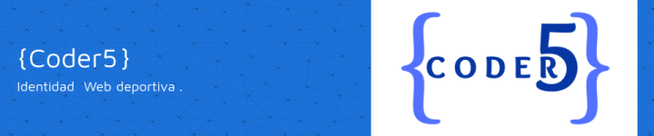
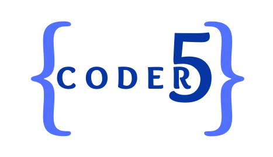
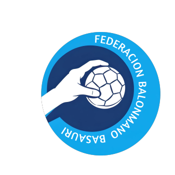
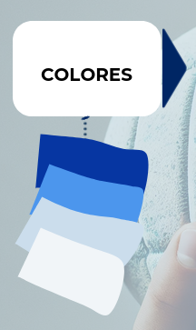
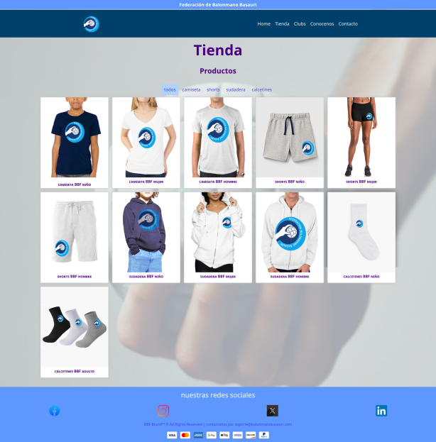
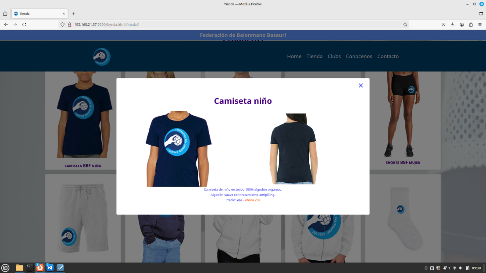
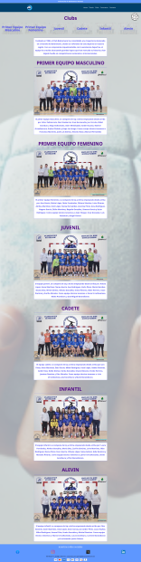
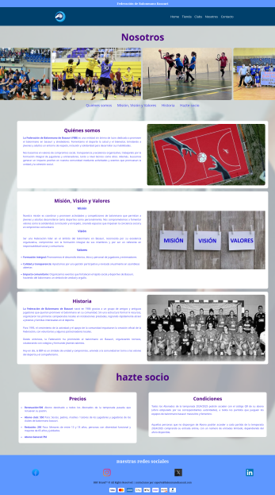
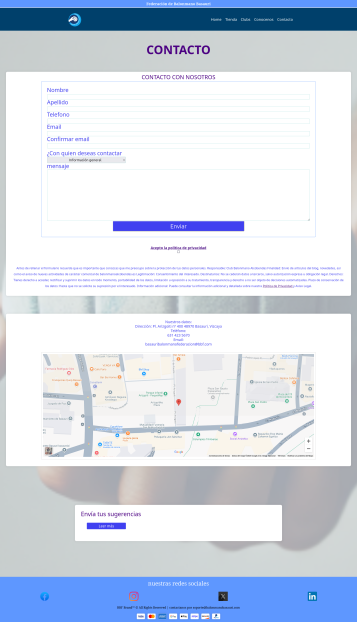

<h1>🖐️ Hi!</h1>

Somos {Coder5} un grupo freelance para creacion de identidad web.

<h2>🚀ABOUT</h2>

Este proyecto consiste en la creación de la identidad web para un club deportivo, diseñado para reflejar su espíritu, noticias e impacto en la comunidad.

La página web actúa como un centro digital para socios, aficionados y visitantes, ofreciendo una experiencia visual atractiva y fácil de usar.

<h2>❓HOW WE WORK</h2>

El desarrollo de la web comenzó con una investigación exhaustiva del club deportivo y las diferentes paginas ya existentes.

Este análisis inicial nos permitió captar la esencia del club y garantizar que la identidad digital refleje fielmente su espíritu.

Finalizamos con la creación de un logo identificativo.

  **Diseño Visual:**
  
            La elección de los elementos visuales fue clave para transmitir la identidad del club.
            
            Optamos por una paleta de colores azules alineada con los tonos representativos del club, asegurándonos de que evocaran el dinamismo del propio juego y profesionalidad.

            

            También seleccionamos tipografías modernas y fácilmente legibles, junto con imágenes que capturan la energía y pasión de sus actividades deportivas

  **Estructura del Sitio:**
  
            La web se compone de cinco páginas principales, diseñadas para ofrecer una experiencia intuitiva y organizada:

            Home: Una página principal que presenta al club junto con las noticias mas importantes del momento y opiniones mas valoradas, con acceso rápido a las secciones más importantes.

            

            Tienda: Una sección donde los aficionados pueden adquirir merchandising oficial, como camisetas, accesorios y otros productos exclusivos.

            
            

            Clubs: Un espacio dinamico dedicado a los equipos del club, donde se detalla cada disciplina deportiva junto con sus respectivos jugadores y entrenadores.

            

            Nosotros: Una página para descubrir la historia del club, sus valores fundamentales y la comunidad que lo respalda junto con información sobre las cuotas de socio.

            

            Contacto: Un formulario de contacto intuitivo, junto con información de ubicación, redes sociales y otros canales de comunicación. 
                      En la misma pagina podemos encontrar un link que lleva a los terminos de politica de privacidad.

            
  
  **Implementación y Optimización:**
  
            El diseño del sitio es responsive, garantizando una experiencia óptima tanto en ordenadores como en dispositivos móviles.
            
            Además, integramos elementos interactivos, como imagenes, animaciones mapas y enlaces directos a redes sociales, para fomentar la interacción con los usuarios.

            Con este enfoque, hemos logrado una web que no solo representa visualmente al club, sino que también refuerza su presencia en línea y facilita la conexión con su comunidad.

<h2>👀CONCLUSION</h2>

Este sitio web es una herramienta clave para el futuro del club, proporcionando un espacio centralizado para informar, inspirar e interactuar con socios, aficionados y nuevos seguidores.

Cada detalle, desde los colores elegidos hasta la estructura intuitiva de sus cinco páginas, ha sido diseñado con el propósito de reflejar la pasión y la energía que definen al club.

Con esta identidad web, el club está preparado para seguir creciendo, compartiendo sus logros y fortaleciendo su vínculo con su comunidad.

<h2>🧑‍🤝‍🧑THE TEAM</h2>

**Scrum Master**
[scrum](https://github.com/SideWalk29)

**Product Owner**
[owner](https://github.com/carlasiles1)

**First Programmer**
[first](https://github.com/Aleeza951)

**Second Programmer**
[second](https://github.com/githpaco)

**Third Programmer**
[thrid](https://github.com/naytxi)

